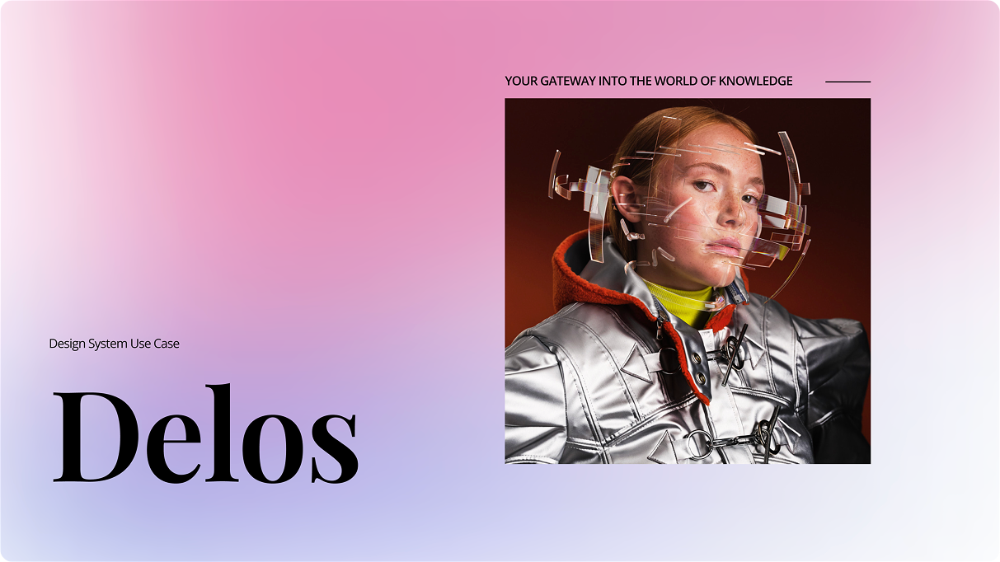

<!-- Banner -->
<p align="center">
  
</p>

<h1 align="center">🔍 Delos : RAG powered Assistant</h1>

<p align="center">
  Instantly fetch design-system tokens, rules, and guidelines from scattered docs using a Retrieval-Augmented Generation (RAG) AI assistant.
</p>

---

## 🚀 Overview

Delos helps UX designers quickly find accurate, source-backed answers to design system questions — without digging through 50-page PDFs or Confluence pages.

Tt leverages:
- **RAG (Retrieval-Augmented Generation)** for source-grounded responses
- **LLMs (Llama via Groq)** for fast, natural-language explanations
- **Command-Line Interface (CLI)** for quick testing and iteration

---

## 🧠 Problem Statement

Designers often waste time navigating scattered design system documents. This leads to:
- Slower onboarding
- Governance violations
- Rework and delivery delays

The assistant solves this by letting designers ask natural questions (e.g. “What’s the spacing token for 16px?”) and instantly get reliable answers grounded in the source.

---

## ⚙️ Tech Stack

- 🦙 **LLM**: Llama (Open Source)
- ⚡️ **LLM Inference**: Groq API (Blazing fast)
- 🔍 **RAG Framework**: LangChain
- 🧾 **Embeddings**: Cohere 
- 📄 **Vector Store**: Chroma-DB (can be upgraded)
- 🕵️‍♀️ **Document Sources**: Design tokens, Confluence exports (In PDFs)

---

## 🧪 Features

✅ Ask natural questions  
✅ Sources are retrieved from your local design documentation  
✅ Hallucination scoring + responsible fallback  
✅ No paid API required — full local control  
✅ Fast local testing via CLI  
✅ Easily extensible for future UI or multi-modal support

---

## 🧠 Hallucination Check

To ensure the reliability of AI-generated answers, the system performs a **hallucination check** that compares the generated response to the source documents. This check uses a confidence threshold set at **60%** — if less than 60% of key answer words appear in the source text, the system flags a potential hallucination or unsupported claims.

Additionally, the system looks for behavioral cues indicating responsible refusals (phrases like “not sure” or “don’t know”), which are treated as a pass to avoid misleading confident answers.

The hallucination status and confidence score are displayed alongside each answer to help you gauge its trustworthiness.

---


## 🚀 Setup Instructions

Follow these steps to set up the project locally.

### 1. 🔁 Clone the Repository

```bash
git clone https://github.com/eldinesh/delos.git
cd Delos
```

### 2. 🧪 Create a Virtual Environment

```bash
# Create the virtual environment
python -m venv venv

# Activate it
# On macOS/Linux:
source venv/bin/activate
# On Windows:
venv\Scripts\activate
```

### 3. 📦 Install Python Dependencies

```bash
pip install -r requirements.txt
```

### 4. 🔐 Environment Variables

```bash
touch .env

# Then Add the below to your file.

# .env
GROQ_API_KEY=your_groq_api_key_here
COHERE_API_KEY=your_cohere_api_key_here
```

### 5. 📁 Add your Data(PDFs Only)

```bash
Add your PDFs under Data Directory.
```

### 6. 🏁 Run the Application

```bash
python main.py
```